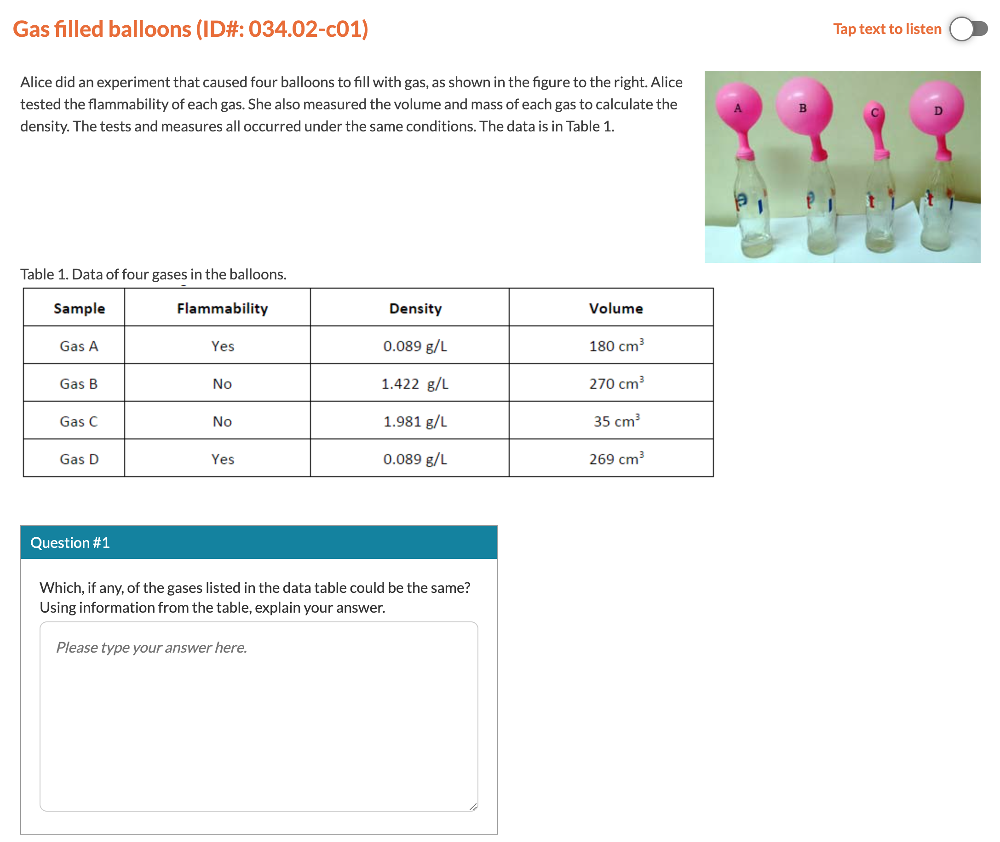

# MoE

## Dataset Overview

This research utilizes pre-existing datasets, incorporating responses from middle school students that have been evaluated by experts for nine multi-label assessment tasks from the PASTA project [1][2]. These assessment tasks are specifically crafted to evaluate middle school students' ability to apply multi-label knowledge in explaining scientific phenomena. The NGSS framework aims to facilitate students in developing applied knowledge across educational levels by integrating disciplinary core ideas (DCIs), crosscutting concepts (CCCs), and science and engineering practices (SEPs) within K-12 performance expectations.

The assessment tasks in this study align with the NGSS middle school-level expectations: students must analyze and interpret data to determine whether substances possess identical properties [3]. This expectation requires students to employ knowledge of the structure and properties of matter, chemical reactions (DCIs), and patterns (CCC) to effectively analyze and interpret data (SEP).

  
*Figure: Illustrative Multi-label Task – Gas-Filled Balloons*

A total of 1,200 students in grades 6–8 participated in this study. Middle school teachers across the U.S. invited their students to engage with open-ended NGSS-aligned science tasks [4]. After data cleaning, fewer than 1,200 responses remained per task (exact counts in the table below). Responses were randomly selected to form training, validation, and test sets for machine learning models. For privacy, all data was anonymized, and demographic details were unavailable. Nonetheless, due to the geographical diversity of participating teachers, the dataset is considered representative of the broader US middle school student population.

The assessment tasks were sourced from the Next Generation Science Assessment [1] and required students to apply fundamental *chemistry* principles to real-world contexts. Falling under the physical sciences domain, specifically "Matter and its Characteristics," these tasks assess students' ability to analyze data and differentiate substances by their attributes. These tasks were designed to assess students' multi-dimensional thinking and provide educators with insights that could inform instructional strategies.

Automated reports derived from rubric-based scoring highlight topics where students may require additional support. For instance, in one task, students were asked to identify gases in an experiment by comparing their properties to those documented in a data table (refer to the figure above). Successfully completing this task required understanding the structure and properties of matter, chemical reactions, and the ability to plan investigations while recognizing patterns in the data.

A structured scoring rubric was developed to encompass five response dimensions, corresponding to the science learning framework: SEP+DCI, SEP+CCC, SEP+CCC, DCI, and DCI. This rubric was designed to capture multi-dimensional cognitive processes [5]. The table below outlines the specific criteria for each category. Students were assessed simultaneously across multiple perspectives, receiving scores that reflected their understanding of DCIs, CCCs, and SEPs as aligned with the rubric. To enhance the validity of these multi-perspective rubrics, the research team collaborated with experienced science educators.

### Scoring Rubric for Task: Gas-Filled Balloons (Task 5)

| ID  | Perspective | Description |
|-----|-------------|-------------|
| E1  | SEP+DCI     | Student states that Gas A and D could be the same substance. |
| E2  | SEP+CCC     | Student describes the pattern (comparing data in different columns) in the table flammability data of Gas A and Gas D as the same. |
| E3  | SEP+CCC     | Student describes the pattern (comparing data in different columns) in density data of Gas A and Gas D, which is the same in the table. |
| E4  | DCI         | Student indicates flammability is one characteristic of identifying substances. |
| E5  | DCI         | Student indicates density is one characteristic of identifying substances. |

### Dataset Information for Multi-label and Multi-class Tasks

| ID     | Item                          | No. Labels | Training Size | Testing Size |
|--------|-------------------------------|------------|----------------|---------------|
| Task 1 | Anna vs Carla                 | 4          | 955            | 239           |
| Task 2 | Breaking Down Hydrogen Peroxide | 4        | 666            | 167           |
| Task 3 | Carlos Javier Atomic Model    | 5          | 956            | 240           |
| Task 4 | Dry Ice Model                 | 3          | 1111           | 278           |
| Task 5 | Gas Filled Balloon            | 3          | 958            | 240           |
| Task 6 | Layers in Test Tube           | 10         | 956            | 240           |
| Task 7 | Model For Making Water        | 5          | 836            | 210           |
| Task 8 | Nami Careful Experiment       | 6          | 653            | 164           |
| Task 9 | Natural Sugar                 | 5          | 956            | 239           |

---

## References

[1] Harris, C.J., Krajcik, J.S., Pellegrino, J.W.: *Creating and using instructionally supportive assessments in NGSS classrooms*. NSTA Press (2024)
[2] PASTA, P.T.: *Supporting instructional decision making: Potential of an auto-matically scored three-dimensional assessment system.* (November, 2023)
[3] Council, N.R., et al.: *Next generation science standards: For states,* by states (2013)
[4] Zhai, X., He, P., Krajcik, J.: *Applying machine learning to automatically assess scientific models.* Journal of Research in Science Teaching 59(10), 1765–1794 (2022)
[5] He, P., Shin, N., Zhai, X., Krajcik, J.: *Guiding teacher use of artificial intelligence-based knowledge-in-use assessment to improve instructional decisions: A conceptual framework.* In: Zhai, X., Krajcik, J. (eds.) Uses of Artificial Intelligence in STEM Education, Oxford University Press (2024)
